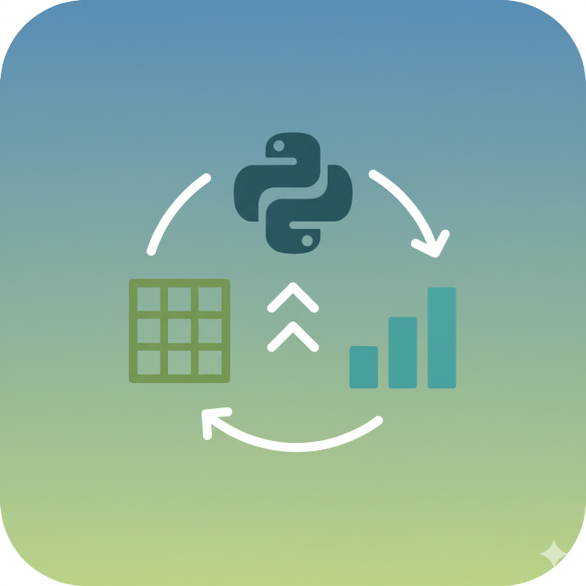

<div align="center">



  <h1 align="center">SalesSync</h1>

  <p align="center">
    <strong>Automação de Análise de Vendas com Python, Excel e Power BI</strong>
  </p>


</div>

## 📘 Visão Geral

O **SalesSync** é um projeto de **automação de análise de vendas**, que combina o poder do **Python**, a praticidade do **Excel** e a visualização dinâmica do **Power BI**.  
O objetivo é simplificar o processo de análise de dados, **eliminando tarefas manuais** e **mantendo relatórios sempre atualizados** com apenas um comando.

---

## 🚀 Funcionalidades

- 📂 **Importação automática** de planilhas Excel com dados de vendas
- 🧹 **Tratamento e limpeza de dados** usando `pandas`
- 💰 **Cálculos automáticos** de totais mensais e por vendedor
- 📊 **Geração de planilhas de resumo** prontas para visualização
- 🔗 **Integração com Power BI**, permitindo dashboards sempre atualizados
- ⚙️ **Automatização completa**, podendo ser executada de forma agendada

---

## 🧰 Tecnologias Utilizadas

| Tecnologia      | Função                                |
| --------------- | ------------------------------------- |
| 🐍 **Python**   | Automação e processamento de dados    |
| 📊 **pandas**   | Manipulação e análise de dados        |
| 📘 **openpyxl** | Leitura e gravação de planilhas Excel |
| 📈 **Excel**    | Armazenamento e entrada dos dados     |
| 🧠 **Power BI** | Visualização e relatórios interativos |

---

## 🧠 Como o SalesSync Funciona

1. O usuário adiciona novos dados em `data/dados_vendas.xlsx`
2. O script Python `analise_vendas.py` é executado
3. O Python limpa, trata e resume os dados
4. O resultado é salvo automaticamente em `data/resumo_vendas.xlsx`
5. O Power BI, conectado a esse arquivo, **atualiza o dashboard com os novos resultados**

---

## 📂 Estrutura do Projeto

```bash
SalesSync/
│
├── data/
│ ├── dados_vendas.xlsx # Planilha original de vendas
│ └── resumo_vendas.xlsx # Planilha gerada automaticamente
│
├── analise_vendas.py # Script principal de automação
└── README.md # Descrição e documentação do projeto
```

## ⚙️ Instalação e Execução

### 1️⃣ Clonar o repositório

```bash
git clone https://github.com/seuusuario/SalesSync.git
cd SalesSync
```

### 2️⃣ Instalar dependências

```bash
pip install pandas openpyxl
```

### 3️⃣ Executar o script

```bash
python analise_vendas.py
```

Após a execução, o arquivo data/resumo_vendas.xlsx será atualizado automaticamente.

## 🔗 Conectando ao Power BI

1. Abra o Power BI Desktop

2. Vá em Obter Dados → Excel

3. Selecione o arquivo data/resumo_vendas.xlsx

4. Monte o dashboard como desejar

5. Marque a opção Atualizar automaticamente ao abrir

6. Agora, toda vez que o Python gerar novos dados, o Power BI será atualizado 🚀

## ✔️ Melhorias Futuras

- 📬 Envio automático de relatórios por e-mail

- 🧾 Geração de relatórios PDF

- 🌐 Conexão com APIs ou bancos de dados online

- ☁️ Publicação do dashboard Power BI na nuvem (Power BI Service)

- 📈 Criação de gráficos automáticos direto no Python

## Colaboradores

<a href="[https://github.com/carlos-hcal](https://github.com/Carlos-hcal/)">
  
</a>

## Licença

SalesSync está licenciado sob a Licença MIT.
